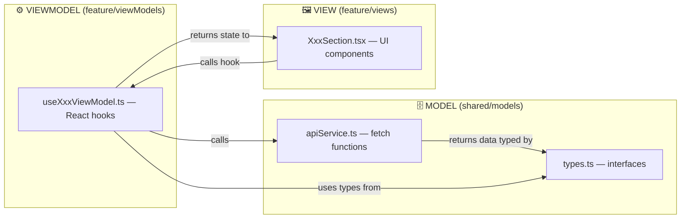

# Frontend Architecture Standard — MVVM

**Status:** Canonical house standard for Alphaexplora front-end builds. **Source project:** `ElGibhor-website-ui` (Vite + React + TypeScript). **Applies to:** all new React front ends, including the ROG build. **Do not edit this document per-project.** It is the shared reference. Project-specific deviations, extensions and exceptions are recorded in that project's own architecture doc — for ROG, see `ROG 05 — Frontend Architecture (MVVM Applied)`.

---

## Why this is in the CMS project docs

Two reasons worth stating before the guide itself.

**1. It is already proven on exactly the site type we keep building.** The feature folders in this guide — `home`, `about`, `experience`, `give`, `engage`, `watch` — match the live navigation on tmgn.ph one for one, and the section components (`HeroSection`, `WelcomeGrid`, `StrategyCards`, `WelcomeVideo`, `WhatToExpect`, `AltarCallCTA`) map directly onto that site's rendered page order. `DaughterChurchesSection` and `PlanVisitModal` line up too. So this is the architecture behind one of the two reference builds, not a theoretical structure — which makes it the right default for ROG rather than something to re-derive.

**2. It makes CMS retrofits predictable.** Step 6 of the POC integration playbook says to fit the Strapi adapter into whatever data-flow pattern the codebase already uses. When every project uses this same pattern, that step stops being a discovery exercise: the adapter always goes in `shared/models/apiService.ts` and is always consumed by a `use<Feature>ViewModel` hook. That is a direct, repeatable cost saving on every future client integration, and it is what turns the POC's "not zero-effort per client" limitation into something closer to a template.

---

## ElGibhor MVVM Architecture Guide

> **[!NOTE]** This document explains the **Model-View-ViewModel (MVVM)** architecture used in the ElGibhor-website-ui project — a Vite + React + TypeScript app. Use this as a reference when prompting Antigravity (or any AI) to scaffold a new project with the same structure.

---

## Full Folder Tree

```
src/
├── main.tsx                 # App bootstrap (renders <App />)
├── App.tsx                  # Router + layout shell
├── index.css                # Global styles
│
├── models/                  # 🚫 LEGACY — duplicated, see shared/models
│   ├── types.ts
│   └── apiService.ts
│
├── viewModels/               # 🚫 LEGACY — duplicated, see feature-level viewModels
│   ├── useHomeViewModel.ts
│   └── useMinistriesViewModel.ts
│
├── shared/                   # 🔵 Cross-cutting concerns (used by ALL features)
│   ├── models/                # Data layer (types + API services)
│   │   ├── types.ts             # TypeScript interfaces / types
│   │   └── apiService.ts        # API calls / data fetching functions
│   ├── hooks/                 # Reusable React hooks
│   │   ├── useMediaQuery.ts
│   │   ├── useMousePosition.ts
│   │   └── useDeviceOrientation.ts
│   ├── utils/                  # Pure utility functions / constants
│   │   └── animations.ts        # Framer Motion animation presets
│   └── components/             # Shared UI components
│       ├── Navbar.tsx
│       ├── Footer.tsx
│       ├── GlobalBackground.tsx
│       ├── PlanVisitModal.tsx
│       ├── PremiumCard.tsx
│       ├── ScrollToTop.tsx
│       ├── ScrollManager.tsx
│       ├── SmoothScroller.tsx
│       ├── CustomCursor.tsx
│       ├── MagneticButton.tsx
│       ├── AdminHeader.tsx
│       └── AdminSidebar.tsx
│
└── features/                 # Feature modules: one folder per navbar tab / page route
    ├── home/
    │   ├── viewModels/
    │   │   └── useHomeViewModel.ts   # ViewModel hook for Home
    │   └── views/
    │       ├── Home.tsx               # Page-level container only
    │       ├── HeroSection.tsx        # Section component
    │       ├── WelcomeGrid.tsx        # Section component
    │       ├── StrategyCards.tsx      # Section component
    │       ├── WelcomeVideo.tsx       # Section component
    │       ├── WhatToExpect.tsx       # Section component
    │       └── AltarCallCTA.tsx       # Section component
    │
    ├── about/
    │   ├── viewModels/
    │   │   └── useAboutViewModel.ts
    │   └── views/
    │       ├── About.tsx              # Page-level container only
    │       ├── AboutUs.tsx
    │       ├── Manifesto.tsx
    │       ├── LeadershipSection.tsx
    │       └── DaughterChurchesSection.tsx
    │
    ├── experience/
    │   ├── viewModels/
    │   │   └── useExperienceViewModel.ts
    │   └── views/
    │       ├── Experience.tsx         # Page-level container only
    │       ├── Events.tsx
    │       ├── ServiceSchedule.tsx
    │       └── MinistriesSection.tsx
    │
    ├── give/
    │   ├── viewModels/
    │   │   └── useGiveViewModel.ts
    │   └── views/
    │       └── Give.tsx
    │
    ├── engage/
    │   ├── viewModels/
    │   │   └── useEngageViewModel.ts
    │   └── views/
    │       ├── Engage.tsx
    │       └── Serve.tsx
    │
    └── watch/
        ├── viewModels/
        │   └── useWatchViewModel.ts
        └── views/
            └── Watch.tsx
```

---

## Feature Folder Rule

`src/features/` should mirror the **main navbar tabs / page routes**.

For this project, the feature folders should come from the visible navigation:

| Navbar tab / route         | Feature folder             | Main page view       |
|-----------------------------|-----------------------------|------------------------|
| Home (`/`)                  | `src/features/home/`        | `views/Home.tsx`       |
| About (`/about`)            | `src/features/about/`       | `views/About.tsx`      |
| Experience (`/experience`)  | `src/features/experience/`  | `views/Experience.tsx` |
| Give (`/give`)               | `src/features/give/`        | `views/Give.tsx`       |
| Engage (`/engage`)          | `src/features/engage/`      | `views/Engage.tsx`     |
| Watch (`/watch`)            | `src/features/watch/`       | `views/Watch.tsx`      |

Each feature folder should have **two main folders**:

```
src/features/<navbar-tab>/
├── viewModels/
│   └── use<Feature>ViewModel.ts
└── views/
    ├── <Feature>.tsx
    └── <SectionComponent>.tsx
```

Example for Home:

```
src/features/home/
├── viewModels/
│   └── useHomeViewModel.ts
└── views/
    ├── Home.tsx
    ├── HeroSection.tsx
    ├── WelcomeGrid.tsx
    ├── StrategyCards.tsx
    ├── WelcomeVideo.tsx
    ├── WhatToExpect.tsx
    └── AltarCallCTA.tsx
```

"The `features/` directory should contain page-level modules, not every small component. Small components belong inside that feature's `views/` folder unless they are reused across multiple features."

---

## The Three MVVM Layers



### 1. Model — `shared/models/`

The **data layer**. Defines *what the data looks like* and *how to get it*.

| File            | Role                                                        |
|------------------|--------------------------------------------------------------|
| `types.ts`       | TypeScript interfaces (`Ministry`, etc.)                     |
| `apiService.ts`  | Async functions that fetch data (currently mock, swappable for real API) |

```ts
// shared/models/types.ts
export interface Ministry {
  id: string;
  title: string;
  description: string;
  imageUrl: string;
}

// shared/models/apiService.ts
import type { Ministry } from './types';

const mockMinistries: Ministry[] = [ /* ... */ ];

export const fetchMinistries = async (): Promise<Ministry[]> => {
  return new Promise((resolve) => setTimeout(() => resolve(mockMinistries), 800));
};
```

> **[!TIP]** The Model layer is completely **framework-agnostic** — no React, no hooks, no JSX. This makes it easy to swap out for a real backend later.

### 2. ViewModel — `features/<navbar-tab>/viewModels/`

The **logic bridge**. Custom React hooks (`use___ViewModel`) that:

- Call the Model's API functions
- Manage React state (`useState`, `useEffect`)
- Expose a **clean return object** of state + actions to Views

```ts
// features/home/viewModels/useHomeViewModel.ts
import { useState, useEffect } from 'react';
import type { Ministry } from '../../../shared/models/types';
import { fetchMinistries } from '../../../shared/models/apiService';

export const useHomeViewModel = () => {
  const [ministries, setMinistries] = useState<Ministry[]>([]);
  const [isLoading, setIsLoading] = useState<boolean>(true);
  const [error, setError] = useState<string | null>(null);

  useEffect(() => {
    const loadData = async () => {
      try {
        setIsLoading(true);
        const data = await fetchMinistries();
        setMinistries(data);
      } catch (err) {
        setError('Failed to load ministries data.');
      } finally {
        setIsLoading(false);
      }
    };
    loadData();
  }, []);

  return { ministries, isLoading, error };
  //        ↑ state     ↑ state    ↑ state — all consumed by Views
};
```

> **[!IMPORTANT]** **Each feature gets its own ViewModel**, even if two features fetch the same data. This keeps concerns isolated — the Home page's ViewModel might slice only 4 ministries, while the Experience page can show a fuller ministries section.

### 3. View — `features/<navbar-tab>/views/`

The **UI layer**. Pure presentation + layout. Views:

- Call their feature's ViewModel hook
- Render JSX using the returned state
- Handle **only** UI-local state (hover, expanded, etc.)

```tsx
// features/experience/views/MinistriesSection.tsx
import { useExperienceViewModel } from '../viewModels/useExperienceViewModel';

export const MinistriesSection: React.FC = () => {
  const { ministries, isLoading } = useExperienceViewModel();
  //      ↑ comes from ViewModel

  const [expandedId, setExpandedId] = useState<string | null>(null);
  //    ↑ UI-only state (not in ViewModel)

  return ( /* render ministries using the state */ );
};
```

**Page-level Views** (`Home.tsx`) compose multiple section components:

```tsx
// features/home/views/Home.tsx
import React, { memo, useState } from 'react';
import { HeroSection } from './HeroSection';
import { WelcomeGrid } from './WelcomeGrid';
import { StrategyCards } from './StrategyCards';
import { WelcomeVideo } from './WelcomeVideo';
import { WhatToExpect } from './WhatToExpect';
import { AltarCallCTA } from './AltarCallCTA';

// Import ang shared centralized modal
import { PlanVisitModal } from '../../../shared/components/planVisit/PlanVisitModal';

export const Home: React.FC = memo(() => {
  const [isPlanVisitOpen, setIsPlanVisitOpen] = useState(false);

  return (
    <div className="bg-transparent flex flex-col w-full relative z-10 overflow-hidden">
      <HeroSection />
      <WelcomeGrid />
      <StrategyCards onOpenVisitModal={() => setIsPlanVisitOpen(true)} />
      <WelcomeVideo />
      <WhatToExpect />

      {/* "THE ALTAR CALL" - Split-Verse Editorial CTA */}
      <AltarCallCTA onOpenVisitModal={() => setIsPlanVisitOpen(true)} />

      {/* COMPANION ENGINE MODAL */}
      <PlanVisitModal
        isOpen={isPlanVisitOpen}
        onClose={() => setIsPlanVisitOpen(false)}
      />
    </div>
  );
});

Home.displayName = "Home";
```

In this pattern, `Home.tsx` is only the page container. The individual sections (`HeroSection`, `WelcomeGrid`, `StrategyCards`, etc.) are separate files under `views/`. Shared UI such as `PlanVisitModal` stays in `shared/components/` because it can be opened from multiple places, including the navbar and page CTAs.

---

## Data Flow Summary

```
User visits /experience
        │
        ▼
App.tsx (Router)
        │  lazy(() => import('./features/experience/views/Experience'))
        ▼
Experience.tsx (VIEW)
        │  renders <MinistriesSection />
        ▼
MinistriesSection.tsx (VIEW)
        │  const { ministries, isLoading } = useExperienceViewModel()
        ▼
useExperienceViewModel.ts (VIEWMODEL)
        │  calls fetchMinistries() from shared/models/apiService
        ▼
apiService.ts (MODEL)
        │  returns Ministry[] (typed by shared/models/types.ts)
        ▼
Data flows back up: MODEL → VIEWMODEL state → VIEW renders
```

---

## Shared Layer — `shared/`

Cross-cutting code that **any** feature can import:

| Folder                 | Purpose                     | Examples                              |
|--------------------------|------------------------------|-----------------------------------------|
| `shared/models/`         | Types + API service          | `types.ts`, `apiService.ts`             |
| `shared/hooks/`          | Reusable React hooks         | `useMediaQuery`, `useMousePosition`     |
| `shared/utils/`          | Pure functions / constants   | `animations.ts` (Framer Motion presets) |
| `shared/components/`     | Global UI components         | `Navbar`, `Footer`, `PlanVisitModal`, `PremiumCard` |

---

## Key Conventions

| Convention                          | Detail                                                                 |
|---------------------------------------|---------------------------------------------------------------------------|
| Feature folder = navbar tab/page      | `features/home`, `features/about`, `features/experience`, etc. should match main navigation routes |
| Two folders per feature               | Use `viewModels/` for hooks and `views/` for page + section components   |
| ViewModel = custom hook                | Named `use<Feature>ViewModel.ts`, returns `{ state, actions }`           |
| Views never call APIs directly        | Always go through a ViewModel hook                                       |
| Feature isolation                     | Each feature folder is self-contained with its own `views/` and `viewModels/` |
| Lazy loading                          | All page-level views are `lazy()` loaded in `App.tsx`                    |
| Shared = global                        | Anything used by 2+ features lives in `shared/`                          |
| UI-only state stays in View            | Hover states, expanded IDs, active indexes — local `useState` in the component |
| Business/data state lives in ViewModel | Loading, error, fetched data — all in the `useXxxViewModel` hook         |

---

## Prompt Template for New Projects

Copy-paste this into a new Antigravity conversation to bootstrap a project with the same architecture:

> Create a Vite + React + TypeScript project using the MVVM architecture with this folder structure:
>
> ```
> src/
> ├── main.tsx
> ├── App.tsx
> ├── index.css
> ├── shared/
> │   ├── models/
> │   │   ├── types.ts          # All TypeScript interfaces
> │   │   └── apiService.ts     # All API/data fetching functions
> │   ├── hooks/                 # Reusable React hooks (useMediaQuery, etc.)
> │   ├── utils/                  # Pure utility functions and constants
> │   └── components/             # Global components (Navbar, Footer, etc.)
> └── features/                  # One folder per navbar tab / page route
>     └── <navbar-tab>/
>         ├── viewModels/
>         │   └── use<Feature>ViewModel.ts   # Custom hook: calls Model, manages state
>         └── views/
>             ├── <Feature>.tsx               # Page container (composes sections)
>             └── <Section>.tsx               # Individual section components
> ```
>
> Rules:
> 1. MODEL (shared/models/): Types + API functions. No React code here.
> 2. VIEWMODEL (features/<navbar-tab>/viewModels/): Custom React hooks named use<Feature>ViewModel.
>    Calls Model layer, manages useState/useEffect, returns { data, isLoading, error }.
> 3. VIEW (features/<navbar-tab>/views/): React components. Calls ViewModel hooks for data.
>    Only manages UI-local state (hover, expanded, etc.) directly.
> 4. Views NEVER call API functions directly — always go through a ViewModel.
> 5. `features/` should contain the main navbar tabs / page routes only, for example `home`, `about`, `experience`, `give`, `engage`, `watch`.
> 6. Each feature folder must contain `viewModels/` and `views/`.
> 7. The main page component, like `Home.tsx`, should only compose section components and own UI-local state such as modal open/close.
> 8. Put each page section in its own file under `views/`, for example `HeroSection.tsx`, `WelcomeGrid.tsx`, `StrategyCards.tsx`.
> 9. Shared code used by 2+ features goes in `shared/`, for example navbar, footer, and centralized modals.
> 10. Each page component is lazy-loaded in App.tsx.
> 11. Use Framer Motion for animations, React Router for routing.
> 12. Use TailwindCSS for styling.
>
> The navbar tabs / page features I need are: [LIST YOUR NAVBAR TABS HERE]

> **[!TIP]** Replace `[LIST YOUR NAVBAR TABS HERE]` with your pages, e.g. `home, about, experience, give, engage, watch`. Antigravity should scaffold one feature folder per tab, each with `viewModels/` and `views/`.

---

*End of house standard. For how this is applied and extended on the ROG build, see `ROG 05 — Frontend Architecture (MVVM Applied)`.*
